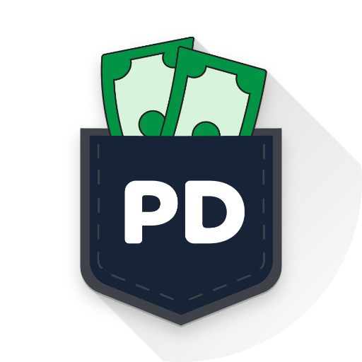

<p align="center">
  
</p>

<h1 align="center">PocketDay</h1>

<p align="center">
  <strong>Know your money. Control your day.</strong>
</p>

<p align="center">
  A simple, focused personal finance manager built for everyday spending.
</p>

<p align="center">
  
  
  
  
  
</p>

<br>

<p align="center">
  
</p>

---

## 💰 About PocketDay

**PocketDay** is a personal finance manager designed around one simple idea:

> **You should always know how much you can safely spend today.**

Instead of overwhelming you with complicated financial tools, PocketDay focuses on the things that matter every day:

* How much money do I have?
* How much have I spent today?
* How much can I safely spend?
* How long can my money last?
* Am I staying within my budget?
* What am I saving toward?

Built with **Flutter + Firebase**, PocketDay combines a clean interface with cloud-backed personal financial data.

---

## ✨ What You Can Do

<table>
<tr>
<td width="50%">

### 🏠 Home

Your financial situation at a glance.

* Current balance
* Today's spending
* Safe daily spending
* Survival days remaining
* Recent activity

</td>
<td width="50%">

### 💸 Transactions

Keep track of your everyday money.

* Add income
* Add expenses
* Categorize transactions
* View transaction history
* Edit and manage transactions

</td>
</tr>

<tr>
<td width="50%">

### 📊 Budget

Understand and control your spending.

* Set budgets
* Monitor spending
* Track budget progress
* Manage subscriptions

</td>
<td width="50%">

### 🎯 Savings

Turn plans into measurable progress.

* Create savings goals
* Track saved amounts
* Monitor goal progress

</td>
</tr>

<tr>
<td width="50%">

### 🔐 Authentication

Secure and simple account access.

* Google Sign-In
* Firebase Authentication
* Persistent sessions

</td>
<td width="50%">

### ☁️ Cloud Sync

Your financial data stays connected.

* Cloud Firestore
* User-specific data
* Firebase-backed synchronization

</td>
</tr>
</table>

---

## 🧭 Simple Navigation

PocketDay keeps the main experience intentionally simple:

```text
┌────────────┬──────────────┬────────┬─────────┬─────────┐
│    Home    │ Transactions │ Budget │ Savings │ Profile │
└────────────┴──────────────┴────────┴─────────┴─────────┘
```

The **Budget** section includes:

```text
Budget  |  Subscriptions
```

so subscriptions remain part of your overall spending picture without cluttering the main navigation.

---

## 🎨 Designed to Stay Out of Your Way

PocketDay follows a simple visual philosophy:

**Clean · Light · Focused · Trustworthy**

### Design principles

* ☀️ Light-mode experience
* 🎯 Information-first layouts
* ⚡ Fast everyday interactions
* 📐 Consistent spacing and typography
* ✨ Subtle, purposeful animations
* 🧘 Minimal visual clutter
* 💳 Finance-focused visual language

PocketDay intentionally avoids excessive gradients, decorative effects, complicated dashboards, and unnecessary UI elements.

---

## 🔐 Authentication Flow

PocketDay uses a lightweight startup experience:

```text
                    App Launch
                        │
                        ▼
                 PocketDay Splash
                        │
                        ▼
                Onboarding Check
                        │
             ┌──────────┴──────────┐
             │                     │
        Not Completed          Completed
             │                     │
             ▼                     ▼
         Onboarding          Auth Check
                                   │
                         ┌─────────┴─────────┐
                         │                   │
                     Logged In          Logged Out
                         │                   │
                         ▼                   ▼
                        Home               Login
                                             │
                                             ▼
                                       Google Sign-In
                                             │
                                             ▼
                                            Home
```

The splash screen is intentionally brief while only lightweight startup checks are performed.

Firestore and other heavy data operations should not block the initial application launch.

---

## 🏗️ Technology

| Technology                  | Role                                 |
| --------------------------- | ------------------------------------ |
| **Flutter**                 | Cross-platform application framework |
| **Dart**                    | Programming language                 |
| **Riverpod**                | State management                     |
| **Firebase Authentication** | User authentication                  |
| **Google Sign-In**          | Authentication provider              |
| **Cloud Firestore**         | Cloud data storage                   |
| **Material 3**              | UI foundation                        |

---

## 🧱 Architecture

PocketDay follows a **Feature-First + MVVM + Repository** architecture.

```text
Feature
│
├── View
│     └── UI
│
├── ViewModel
│     └── State & Business Logic
│
├── Repository
│     └── Data Access
│
└── Models
      └── Data Structures
```

This keeps UI, application logic, and data access separated and easier to maintain.

---

## 📁 Project Structure

```text
lib/
│
├── core/
│   ├── constants/
│   ├── theme/
│   ├── routing/
│   └── services/
│
├── features/
│   ├── auth/
│   ├── onboarding/
│   ├── home/
│   ├── transactions/
│   ├── budget/
│   ├── savings/
│   └── profile/
│
└── main.dart
```

---

## 🚀 Getting Started

### Requirements

* Flutter SDK
* Dart SDK
* Android Studio
* Android SDK
* Git

Verify your environment:

```bash
flutter doctor
```

### Clone

```bash
git clone <repository-url>
cd pocketday
```

### Install Dependencies

```bash
flutter pub get
```

### Run

```bash
flutter run
```
---

## 🔥 Firebase Setup

PocketDay uses Firebase for authentication and cloud storage.

### Firebase Services

* Firebase Authentication
* Google Sign-In
* Cloud Firestore

Each user's financial data is associated with their authenticated Firebase UID.

> **Note:** Firebase configuration is project-specific. Developers setting up their own environment should configure Firebase using the appropriate FlutterFire configuration for their Firebase project.

---

## 🧪 Testing

Before creating a release build:

```bash
flutter analyze
flutter test
flutter build apk --release
```

For web:

```bash
flutter build web
```

### Current Release

**Version:** `1.0.0-beta.1`

**Status:** 🟡 Beta

This release is intended for testing and feedback.

---

## 📱 Beta Testing

The Android test APK is distributed through **GitHub Releases**.

### Please test

**🔐 Authentication**

* Google Sign-In
* Login persistence
* Logout
* Restarting the app while logged in

**💸 Transactions**

* Adding income
* Adding expenses
* Editing transactions
* Deleting transactions
* Transaction history

**📊 Financial calculations**

* Balance
* Today's spending
* Safe daily spending
* Budget calculations
* Savings progress
* Survival days

**☁️ Cloud data**

* Data synchronization
* Data persistence
* Correct user data

**🧭 Navigation**

* Home
* Transactions
* Budget
* Savings
* Profile
* Budget / Subscriptions

**🎨 UI**

* Layout
* Text overflow
* Buttons
* Loading states
* Small-screen layouts
* Splash screen
* Login experience

---

## 🐛 Found a Bug?

Please include:

```text
Bug:
What happened?

Steps to reproduce:
1.
2.
3.

Expected:
What should have happened?

Actual:
What actually happened?

Device:
Android version:
```

Screenshots and screen recordings are especially helpful.

---

## 🛣️ Roadmap

PocketDay is being developed incrementally with the focus remaining on useful everyday financial tools.

Possible future improvements:

* 📈 Advanced spending analytics
* 🧠 Smarter spending insights
* 💰 Improved budget intelligence
* 🎯 Enhanced savings planning
* 🔄 Better recurring transactions
* ⚡ Performance improvements
* 🛡️ Production hardening

The goal is not to add features simply for the sake of adding them.

---

## ⚠️ Disclaimer

PocketDay is a personal finance tracking application.

It is **not** intended to provide:

* Financial advice
* Investment advice
* Tax advice
* Legal advice

During the beta period, PocketDay should not be treated as the sole record of your financial information.

---

## 📄 License

The project license will be added once finalized.

---

## 👨‍💻 Project

**PocketDay**

Personal Finance Manager for Everyday Spending.

```text
Platform   Android / Web
Framework  Flutter
Backend    Firebase
State      Riverpod
Version    1.0.0-beta.1
Status     Beta
```

---

<p align="center">
  <strong>PocketDay</strong>
  <br>
  Know your money. Control your day.
</p>

<p align="center">
  Built with Flutter ❤️
</p>
